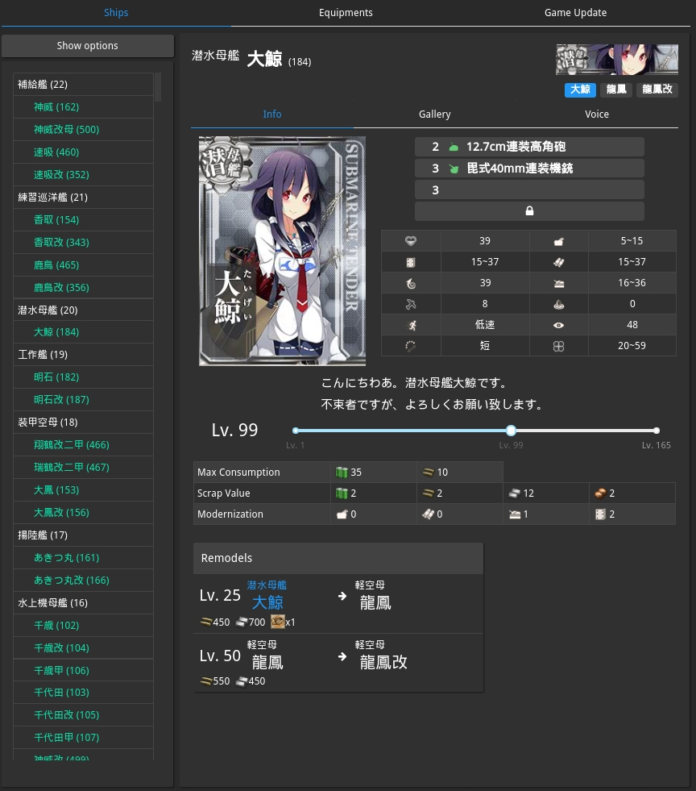
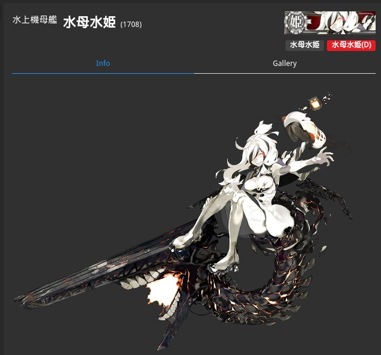
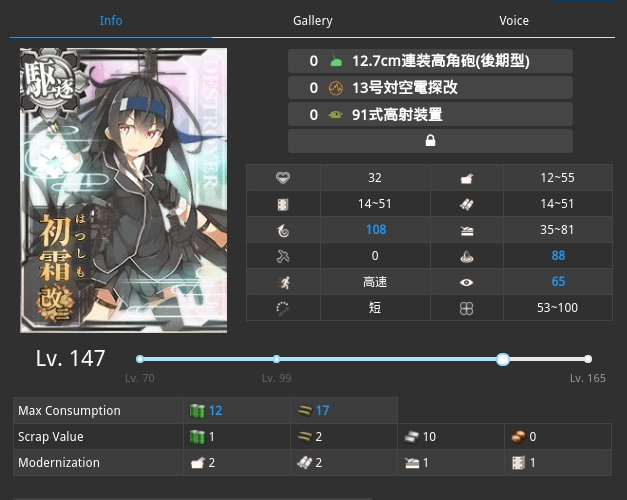
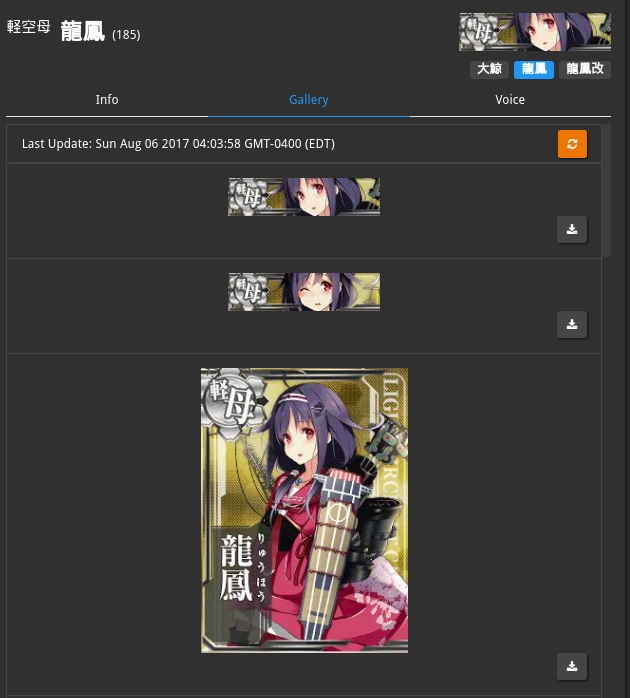
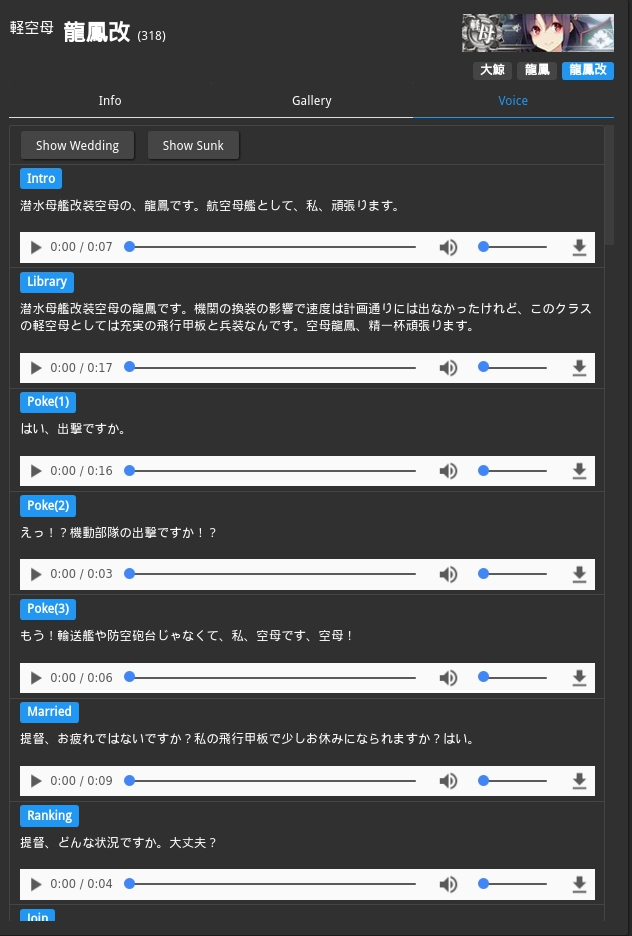
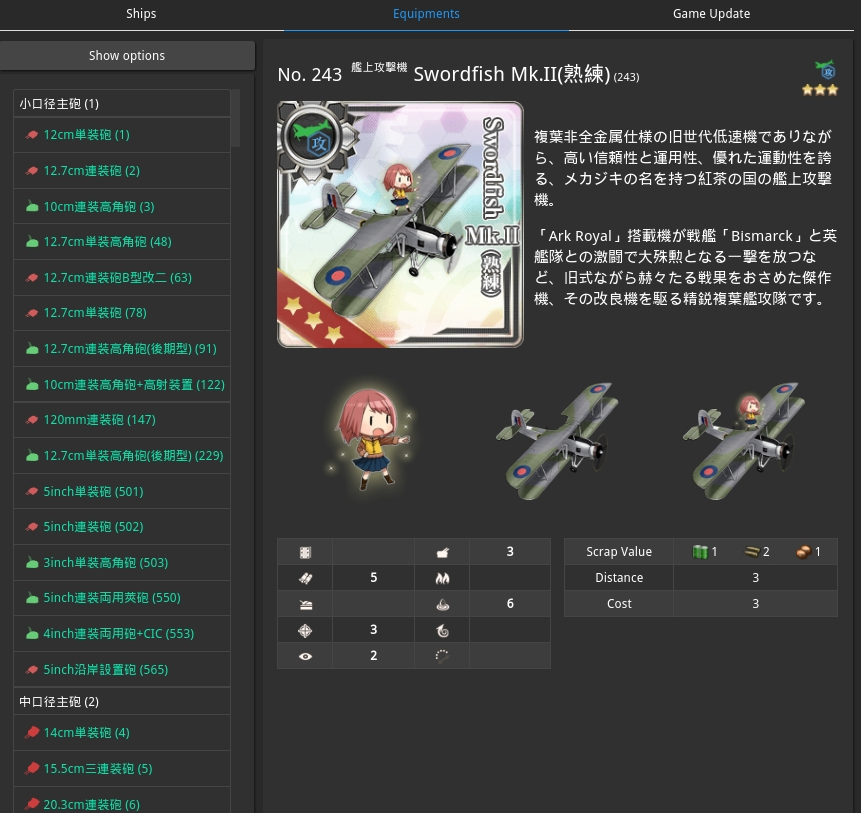
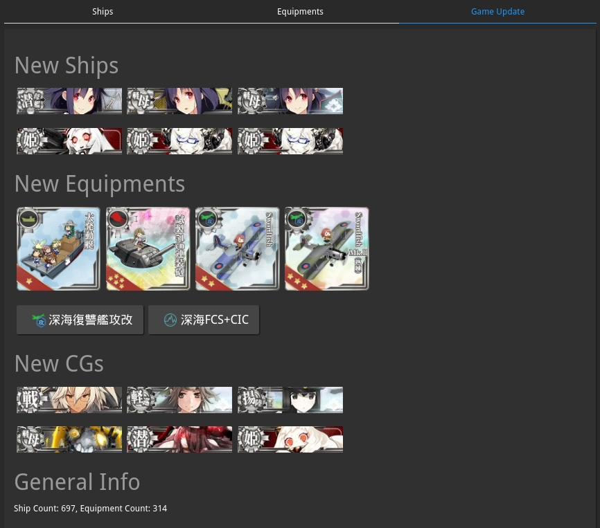

# Navy Album

Navy Album is a [poi](https://github.com/poooi/poi) plugin that shows
illustrations, ship and equipment stats, and things beyond.

## Changelog

### 1.7.17

- Supoort level slider up to Lv.185.
- Update assets, incl. Richard P. Leary remodel cost.

### 1.7.16

- Update assets

### 1.7.15

- Update assets (Shirayuki K2).

### 1.7.14

- Update assets (Fujinami K2).

### 1.7.13

- Update assets (Kirishima K2C & Kayashimo K2).

### 1.7.12

- Fix broken resource hack path.

### 1.7.11

- Update assets.
- Resource hack now overrides in-game asset if exists.

### 1.7.10

- Update assets.
- "Overseas Warship Technology" is now displayed for Richelieu Deux.

### 1.7.9

- Update assets for Hatsuzuki K2.

### 1.7.8

- Update assets.

### 1.7.7

- Harusame K2 update, add screw as one type of remodel cost.
- Display Gun Mat cost.
- Version 1.7.6 is the same as 1.7.5, I probably bumped version twice by mistake.

### 1.7.5

- Heian Maru (and Kai) should have special CGs.
- Update assets.

### 1.7.4

- Update assets.

### 1.7.3

- Fix broken equipment images.

### 1.7.2

- Update assets.

### 1.7.1

- Update assets.

### 1.7.0

- Some internal cleanups.
- Change the way ships are sorted so same-class ships are closer to each other.
- Migrate to Blueprintjs.
- Update assets.

### 1.6.11

- Update assets.
- Fix some cases where new equipment stats are not displayed.

### 1.6.10

- Update assets.

### 1.6.9

- Update assets (including Shigure K3).

### 1.6.8

- Level slider now allows Lv. 180.

### 1.6.7

- Update assets.

### 1.6.6

- Update assets.

### 1.6.5

- Update assets.

### 1.6.4

- Update assets.
- Fix equipment images.

### 1.6.3

- Update assets
- Account for abyssal equipment id changes

### 1.6.2

- Update assets

### 1.6.1 (retro)

- Not sure what the fuck happened here.

### 1.6.0 (retro)

- Japanese translation

### 1.5.2

- Update assets

### 1.5.1

- Update assets
- Include special gallery for Maryland & Maryland Kai

### 1.5.0

- Update assets
- Now remodel info displays item consumptions in recent updates (i.e. 新型航空兵装資材, 新型兵装資材, and 新型高温高圧缶)

### 1.4.1

- Update assets

### 1.4.0

- Fix an issue that causes old (cached) ship graphs to show up.
- Gallery now shows special attack graph for submarine tenders (AS) and Big Sevens.
- Fix Souya's remodel info.
- Few UI improvements.
- Fix an issue so that audios from music library can play exclusively.
- Correct instant build and dev mat cost for all ship remodels.

### 1.3.8

- Update assets.

### 1.3.7

- Fix the same issue as in previous version but done more properly.
  (which turns out not to be a phantom ship)

### 1.3.6

- Fix a issue that non-existing ship causes UI crash.

### 1.3.5

- Update assets.

### 1.3.4

- Update assets.

### 1.3.3

- Fixed some scrolling issue, yet again.

### 1.3.2

- Update assets.

### 1.3.1

- Fix scrolling.
- Update some assets.
- Update devmat & instantbuild consumption on remodels.

### 1.3.0

- Note that this was previously labelled version 1.3.0 because I screwed up versioning.
- Update on assets.
- Fix slot num display.
- Fix equipment page. (descriptions are still missing.)

### 1.2.1

- Update shipgraph path on "full" type

### 1.2.0

- Fix ship CG change detection
- Update few assets

### 1.1.0

- Completely dropped support for SWF extraction, now all sources are from phase 2, enjoy.

### 1.0.1

- Fixed IPC support
- Fixed some crash on new poi installations

### 1.0.0

- The plugin is no longer a separated process.
  In simple words, less memory consumption than before.
- Update few assets
- Gallery is now using HTML5 resources if possible
    - As a result, memory usage will be much better than before, give it a shot xD
    - However sometimes SWF sources will still be used for abyssal ships
      because some abyssal debuff'ed CGs are nowhere to be found in phase 2 resources.
- Level slider upper bound is now 175 for the obvious reason.
- Music Library is now using phase 2 music sources
- Ship Graph change detection improved

### 0.7.8

- Update few assets

### 0.7.7

- Update few assets

### 0.7.6

- Update few assets
- Fix & Update problems with devmat & instant build consumption

### 0.7.5

- Ship text search is now case-insensitive.

### 0.7.4

- All music under music library now loops
- Fix crash when saving gallery images

### 0.7.3

- Improved error handling
- Ship upgrade info for Tatsuta K2, Zuihou K2 and Zuihou K2B is now available
- Updated some abyssal info

### 0.7.2

- Fix crash caused by removed equipments

### 0.7.0

- Game Update Panel now groups together ships that belong to the same remodel chain.
- Game Update Panel now pops up special CGs (if possible) when mouse moves over a ship.
- Default Digest updated (as of Feb 4, 2018 before maintenance)

### 0.6.0

- Implemented Music Library

### 0.5.1

- Fix crashes when viewing some ships

### 0.5.0

- More robust ipc handling
- Improved SWF caching mechanism

### 0.4.3

- Now using WhoCallsTheFleet data from fcd
- Show improvement of default equipments

### 0.4.2

- Panel Update for react-bootstrap

### 0.4.1

- Fix a problem in SWF extraction.
- Some routine updates (WCTF, etc.)
- Show action report consumption in remodel info.
- Updated game server list.

### 0.4.0

- Need poi 8.0+ to work
- Enable searching by romaji and kana (@KagamiChan)
- Abyssal ship name suffixes are now displayed (@KagamiChan)

### 0.3.5

- Update WhoCallsTheFleet database
- Fix a problem in SWF extraction

### 0.3.4

- Improved IPC handling
- Fix: some invalid ships stats are no longer displayed
- Implemented docking time preview

### 0.3.3

- Fix: evasion / ASW / LoS not being displayed
- Update WhoCallsTheFleet database

### 0.3.2

- Update WhoCallsTheFleet database
- Update Abyssal info from KC3 replayer

### 0.3.1

- Better support when running in backgound

### 0.3.0

- Update WhoCallsTheFleet database
- Update default update digest
- Implemented IPC:

    - `showShip(<MasterId>)`
    - `showEquip(<MasterId>)`

### 0.2.5

- Update WhoCallsTheFleet database

### 0.2.4

- Better handling for special CGs (again)
- Ship's internal HP range is now available in tooltip.
- Update WhoCallsTheFleet database

### 0.2.3

- Update WhoCallsTheFleet database
- Fix remodel cost for Saratoga Mk.II & Saratoga Mk.II Mod.2
- Better handling for special CGs

### 0.2.2

- Fix a problem which causes the whole plugin unusable.

### 0.2.1

- i18n

### 0.2.0

- Improvements to "Remodels" Panel

  - wider layout
  - clicking on remodels to switch between ships

- Implemented search bar for both ships and equipments

### 0.1.1

- "New CGs" => "Updated CGs"
- Fix torpedo stats not being displayed correctly

### 0.1.0

- Fix a problem that blueprints and catapults are not correctly displayed
  for ships that have cyclic remodel chains.
- Now audios are only loaded when start playing
- The color for max comsumption only changes when Level > 99
- Show after-marriage max HP when Level > 99
- Slightly reduce package size (using rc-slider dist)

## Features

### Ship Viewer

Shows ship stats and remodel-related information.

### Remodel Switcher

Click on header labels to switch between remodels of the same ship quickly.

This also works on some abyssal ships, if they have a "debuffed" form.

### Info Tab

A level slider to view some level-dependent stats.

### Gallery

Shows CGs extracted directly from game assets for you to view and download.

### Voice

Listen to their voices under every situations, downloads are also available.

Subtitles are displayed if [poi-plugin-subtitle](https://github.com/kcwikizh/poi-plugin-subtitle)
is installed and enabled.

## Equipment Viewer

Show equipments stats

## (experimental) Game Update Viewer

Detect changes to game assets automatically (the screenshot is just for demonstration)

## Acknowledgement

- [WhoCallsTheFleet](https://github.com/Diablohu/WhoCallsTheFleet) for providing
  stock equipment and ship's hidden stats data.

- [kancolle-replay](https://github.com/KC3Kai/kancolle-replay) for providing
  abyssal stats.
